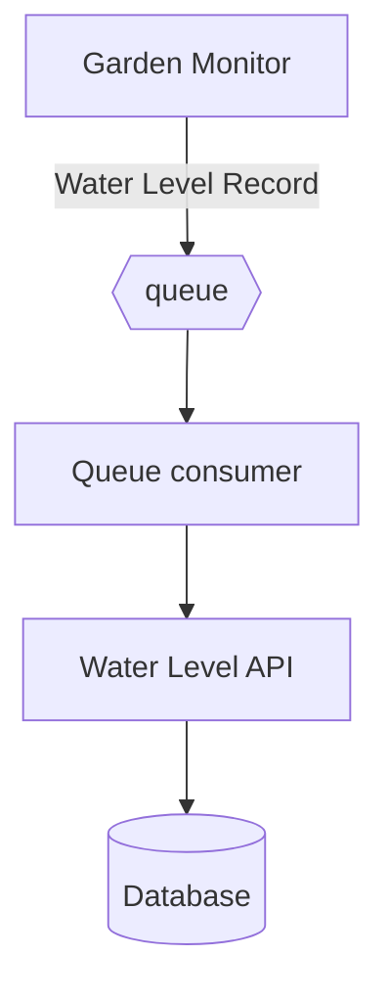

# GardenMonitor
Monitor Garden tank water level by sending data to a queue and storing it in a database.

## Table of Contents
- [GardenMonitor](#gardenmonitor)
  - [Table of Contents](#table-of-contents)
  - [Flow Diagram](#flow-diagram)
  - [Controller](#controller)
    - [Setup](#setup)
    - [Execution](#execution)
  - [Queue Consumer](#queue-consumer)
    - [Setup](#setup-1)
    - [Execution](#execution-1)
  - [API](#api)
    - [Setup](#setup-2)
    - [Execution](#execution-2)
    - [Docker](#docker)
  - [Database](#database)
    - [Setup](#setup-3)
  - [Queue](#queue)
    - [Setup](#setup-4)

## Flow Diagram



## Controller
### Setup
Setup is done in banana pi m2 zero with armbian bullseye.

- install Go
- setup .profile / .bashrc / .zshrc

Install dependencies
```bash
make setup
```

### Execution
```bash
make run-garden-monitor
``````

## Queue Consumer
### Setup

### Execution
```bash
make run-queue-consumer
```

## API
### Setup

### Execution
```bash
make run-api
```

### Docker
Create image
```bash
docker build -f waterapi.Dockerfile . -t waterapi 
```

## Database
### Setup
Local environment : Postgres
```bash
docker run --name postgres-db -e POSTGRES_PASSWORD=mysecretpassword -e POSTGRES_USER=user -e POSTGRES_DB=waterlevel -p 5432:5432 -d postgres
```

## Queue
### Setup
Local environment : Redis
```bash
docker run --name queue -p 6379:6379 -d redis
```